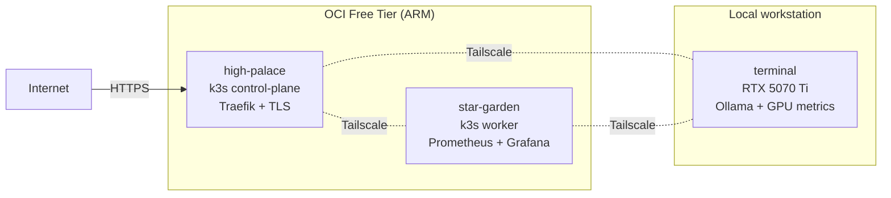

# Grant

Infrastructure engineer in transition — currently at JPMorgan Chase, teaching myself SRE by running production-style systems at home.

## Flagship

**[homelab](https://github.com/GRANTUR/homelab)** — multi-node k3s cluster on OCI Free Tier with Tailscale mesh, Traefik + Let's Encrypt, Prometheus/Grafana/Loki/Alertmanager, Sealed Secrets, Terraform IaC.

## Supporting

**[chronicle](https://github.com/GRANTUR/chronicle)** — FastAPI + Discord calendar assistant that bridges Google Calendar and Outlook with LLM analysis. Deployed on the homelab above.

## Currently learning

- **FluxCD** — pull-based GitOps to replace my current `kubectl apply` loops.
- **SLO dashboards** — error budgets and burn-rate alerts from existing Prometheus data.
- **Terraform remote state** — OCI Object Storage backend with state locking.

---
